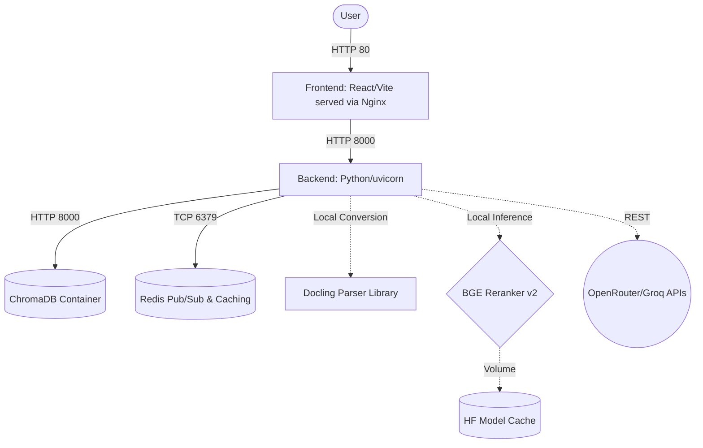

# RAG Arena 2026: The Master Blueprint

This document serves as the single source of truth for the entire RAG Arena 2026 application. It covers business goals, architecture, workflows, quality guarantees, and operational procedures, ensuring any new developer understands exactly how the system is engineered from the ground up.

---

## 🎯 1. Overview & Vision

**Problem**: Retrieval-Augmented Generation (RAG) is notoriously easy to demo but incredibly hard to bring to enterprise production. Most systems fail due to poor chunking, hallucinations, prompt injections, or lack of evaluation feedback loops. 
**Solution**: RAG Arena 2026 provides 4 discrete architectural "Tiers" of RAG running side-by-side, allowing users to physically experience the difference between a naive LangChain tutorial script ("RAG Starter") and a resilient, high-fidelity Enterprise system ("RAG Modern").

### Goals (The "Why")
- **Structural Differentiation**: Showcase that better AI relies on better data architecture (parsing, hybrid search, reranking), not just better prompts.
- **Enterprise Readiness**: The application itself must be Enterprise-grade (secure, fast, deterministic builds).
- **Fast Local Deployment**: 1-click Docker orchestration with no global system dependencies (Python, C++ bindings, etc.) polluting the developer's host machine.

### Non-Goals (What we are explicitly NOT doing)
- We are **not** building an Agentic loop (self-reflection, tool use, multi-step orchestration). This strictly targets RAG (Search + Synthesis).
- We are **not** optimizing for cost at the Enterprise tier. Tier 4 will freely use compute for cross-encoder reranking and rigorous metadata extraction to guarantee accuracy.
- We are **not** building our own Vector database or OCR model. We leverage industry standards (Chroma, Docling, BGE) aggressively.

---

## 🏗️ 2. System Architecture (`/arch`)

The unified stack is orchestrated via a monolithic `docker-compose.yml` defining the frontend, backend, Redis, and Chroma services. The host system's only requirement is Docker.

### Component Diagram


### Data Boundaries
- **Frontend** is purely static. Built in milliseconds using `Bun`. 
- **Backend** is stateless horizontally, maintaining state using Redis. Built using `uv` (Rust-based pip).
- **Docling** is used in-process for rich document conversion (`pdf`, `pptx`, `docx`, `html`, `xlsx`), while `md`, `txt`, `json`, and `csv` are used directly.
- **Reranker** runs locally in the backend using FP16 to maximize performance and avoid external API latency/costs per query.

---

## 📊 3. The 4 Structural Tiers

The core mechanic of the arena is split pipelines. Global uploads process the active tier first and then background the remaining tiers. Session attachments upload immediately but only process the current tier when the first prompt is sent. At query time, each tier uses a different retrieval strategy.

| Feature | Tier 1: RAG Starter | Tier 2: RAG Plus | Tier 3: RAG Enterprise | Tier 4: RAG Modern (2026) |
| :--- | :--- | :--- | :--- | :--- |
| **Parsing** | Direct text or Docling rich conversion | Direct text or Docling rich conversion | Direct text or Docling rich conversion | Direct text or Docling rich conversion |
| **Chunking**| Fixed-size Token Splitting | Semantic Paragraph Splitting| Semantic Chunking (Enterprise profile) | Layout/Page-aware + LangExtract enrichment |
| **Indexing**| Chroma (Dense Only) | Chroma (Dense + Sparse BM25)| Chroma (Dense + Sparse BM25)| Chroma (Dense + Sparse BM25) |
| **Search** | Top 3 Dense Vector | Reciprocal Rank Fusion (Top 5)| Deep RRF + **BGE Reranker v2** + Semantic Cache | Deep RRF + Reranker + Enrichment Boost + Semantic Cache |
| **Eval** | Pipeline eval result published | Pipeline eval result published | LLM-as-a-judge with heuristic fallback | LLM-as-a-judge with heuristic fallback |

Supported upload formats:

- Direct-use: `.md`, `.txt`, `.json`, `.csv`
- Docling-converted: `.pdf`, `.docx`, `.pptx`, `.html`, `.htm`, `.xlsx`

Detailed workflow diagrams live in [`docs/rag-tier-workflows.md`](docs/rag-tier-workflows.md).

---

## 🛡️ 4. Security & Safety (`/sec`)

The backend implements rigorous OWASP LLM 2025 standard mitigations:

1. **Privilege Dropping**: The python container creates an `appuser` system account and explicitly runs `uvicorn` as non-root to prevent escalation vulnerabilities.
2. **Network Scoping**: Redis and Chroma are kept inside a private `rag_net` Docker bridge. They are not addressable from the outside world except through the compose topology.
3. **Supply Chain Pinning**: Backend Python dependencies are locked in `uv.lock`, and containerized dependencies are isolated to explicit services.
4. **Input Sanitation**: Output HTML is scrubbed of `<script>`, `iframe`, and JS generic event handlers (`onerror=` etc.) to prevent LLM-driven XSS injection attacks on the React frontend.
5. **Prompt Injection Headers**: System instructions aggressively sandbox the user's input, preventing "forget previous instructions" jailbreaks.

---

## 🚀 5. Operations & Deployment (`/ship`)

### Running Locally / CI-CD

```bash
# 1. Environment (Requires OPENROUTER_API_KEY)
cp backend/.env.example backend/.env

# 2. Build & Serve
docker compose up --build
```
> **Note**: The `.env` file is intentionally configured as `required: false` in Docker Compose. In Production deployments (Railway, Vercel, ECS), inject these as Native Secrets on the platform to prevent file-scoping issues.
> **Docker-only workflow**: No host Python virtualenv is required. The backend container manages its own internal environment.

### Required Production Infrastructure Sizes
- **CPU**: 4 vCPUs minimum (Needed to run local BGE HuggingFace Transformers concurrently without spiking response times above 5 seconds).
- **RAM**: 8GB RAM minimum. Docling conversion plus local reranking and model caches can be memory-intensive under concurrent use. 1GB/2GB droplets will terminate with OOM errors.
- **Port Mapping**: Only expose port `80` (Frontend) and `443` (SSL Router).

---

### Conclusion
RAG Arena 2026 demonstrates that the best AI is ultimately Software Engineering. It isolates untrusted LLM generation, secures structural ingestion routines, builds observability loops from Day 1, and wraps it cleanly into repeatable, isolated compute infrastructure.
